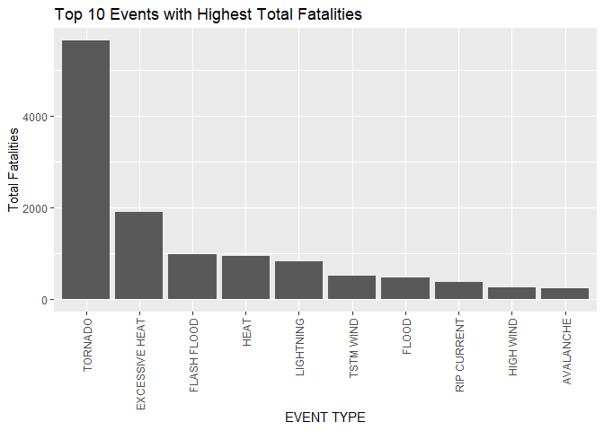
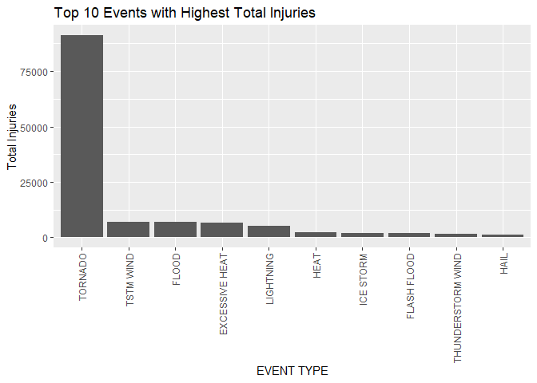
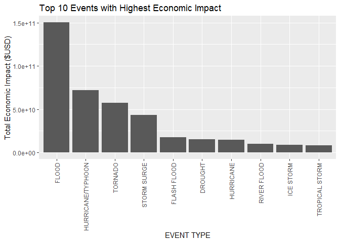

####Introduction

Storms and other severe weather events can cause both public health and economic problems for communities and municipalities. Many severe events can result in fatalities, injuries, and property damage, and preventing such outcomes to the extent possible is a key concern.

This project involves exploring the U.S. National Oceanic and Atmospheric Administration's (NOAA) storm database. This database tracks characteristics of major storms and weather events in the United States, including when and where they occur, as well as estimates of any fatalities, injuries, and property damage.


###Data Download
Unzip and Load the from bzp2


```r
df <- read.csv("data/repdata_data_StormData.csv.bz2")
```

###Analyzing Data
First of all, evaluate the total fatalities and total injuries for each event type help us to understand the health impact.


```r
library(dplyr)
```

```
## 
## Attaching package: 'dplyr'
```

```
## The following objects are masked from 'package:stats':
## 
##     filter, lag
```

```
## The following objects are masked from 'package:base':
## 
##     intersect, setdiff, setequal, union
```

```r
df.fatalities <- arrange(
    summarise(
        group_by(
            select(
                df,
                EVTYPE,
                FATALITIES
            ),
            EVTYPE
        ),
        total.fatalities = sum(FATALITIES)
    ),
    -total.fatalities
)

head(df.fatalities, 10)
```

```
## # A tibble: 10 x 2
##    EVTYPE         total.fatalities
##    <fct>                     <dbl>
##  1 TORNADO                    5633
##  2 EXCESSIVE HEAT             1903
##  3 FLASH FLOOD                 978
##  4 HEAT                        937
##  5 LIGHTNING                   816
##  6 TSTM WIND                   504
##  7 FLOOD                       470
##  8 RIP CURRENT                 368
##  9 HIGH WIND                   248
## 10 AVALANCHE                   224
```

And the injuries ...


```r
df.injuries <- arrange(
    summarise(
        group_by(
            select(
                df,
                EVTYPE,
                INJURIES
            ),
            EVTYPE
        ),
        total.injuries = sum(INJURIES)
    ),
    -total.injuries
)

head(df.injuries, 10)
```

```
## # A tibble: 10 x 2
##    EVTYPE            total.injuries
##    <fct>                      <dbl>
##  1 TORNADO                    91346
##  2 TSTM WIND                   6957
##  3 FLOOD                       6789
##  4 EXCESSIVE HEAT              6525
##  5 LIGHTNING                   5230
##  6 HEAT                        2100
##  7 ICE STORM                   1975
##  8 FLASH FLOOD                 1777
##  9 THUNDERSTORM WIND           1488
## 10 HAIL                        1361
```

####Study the Economical Impact
There`s two economic impacts:  
[1] Property Damage(PROPDMG)
[2] Crop Damage(CROPDMG)

The actual damage in $USD is indicated by PROPDMGEXP and CROPDMGEXP parameters.


```r
# Define the dataframe
df.damage <- select(df, EVTYPE, PROPDMG,PROPDMGEXP,CROPDMG,CROPDMGEXP)

# Ordered by PROPDMGEXP
Symbol <- sort(unique(as.character(df.damage$PROPDMGEXP)))
# List of multipliers
Multiplier <- c(0,0,0,1,10,10,10,10,10,10,10,10,10,10^9,10^2,10^2,10^3,10^6,10^6)

convert.Multiplier <- data.frame(Symbol, Multiplier)

df.damage$Prop.Multiplier <- convert.Multiplier$Multiplier[match(df.damage$PROPDMGEXP, convert.Multiplier$Symbol)]

df.damage$Crop.Multiplier <- convert.Multiplier$Multiplier[match(df.damage$CROPDMGEXP, convert.Multiplier$Symbol)]

df.damage <- df.damage %>% mutate(PROPDMG = PROPDMG*Prop.Multiplier) %>% mutate(CROPDMG = CROPDMG*Crop.Multiplier) %>% mutate(TOTAL.DMG = PROPDMG+CROPDMG)

df.damage.total <- df.damage %>% group_by(EVTYPE) %>% summarize(TOTAL.DMG.EVTYPE = sum(TOTAL.DMG))%>% arrange(-TOTAL.DMG.EVTYPE) 

head(df.damage.total,10)
```

```
## # A tibble: 10 x 2
##    EVTYPE            TOTAL.DMG.EVTYPE
##    <fct>                        <dbl>
##  1 FLOOD                 150319678250
##  2 HURRICANE/TYPHOON      71913712800
##  3 TORNADO                57352117607
##  4 STORM SURGE            43323541000
##  5 FLASH FLOOD            17562132111
##  6 DROUGHT                15018672000
##  7 HURRICANE              14610229010
##  8 RIVER FLOOD            10148404500
##  9 ICE STORM               8967041810
## 10 TROPICAL STORM          8382236550
```

###Health Impact


```r
library(ggplot2)

g <- ggplot(
    df.fatalities[1:10,],
    aes(x=reorder(EVTYPE, -total.fatalities), y=total.fatalities))+
    geom_bar(stat="identity")+
    theme(axis.text.x = element_text(angle=90, vjust=0.5, hjust=1))+
    ggtitle("Top 10 Events with Highest Total Fatalities")+
    labs(x="EVENT TYPE", y="Total Fatalities")

g
```

<!-- -->


```r
g <- ggplot(
    df.injuries[1:10,],
    aes(x=reorder(EVTYPE, -total.injuries), y=total.injuries))+
    geom_bar(stat="identity")+
    theme(axis.text.x = element_text(angle=90, vjust=0.5, hjust=1))+
    ggtitle("Top 10 Events with Highest Total Injuries")+
    labs(x="EVENT TYPE", y="Total Injuries")

g
```

<!-- -->

###Economic Impact


```r
g <- ggplot(
    df.damage.total[1:10,],
    aes(x=reorder(EVTYPE, -TOTAL.DMG.EVTYPE), y=TOTAL.DMG.EVTYPE))+
    geom_bar(stat="identity")+
    theme(axis.text.x = element_text(angle=90, vjust=0.5, hjust=1))+
    ggtitle("Top 10 Events with Highest Economic Impact")+
    labs(x="EVENT TYPE", y="Total Economic Impact ($USD)")

g
```

<!-- -->

